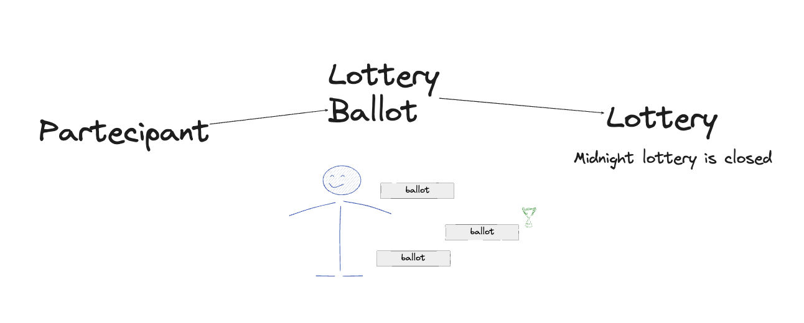
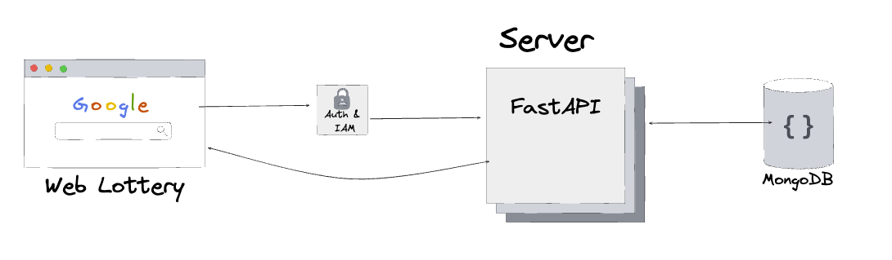
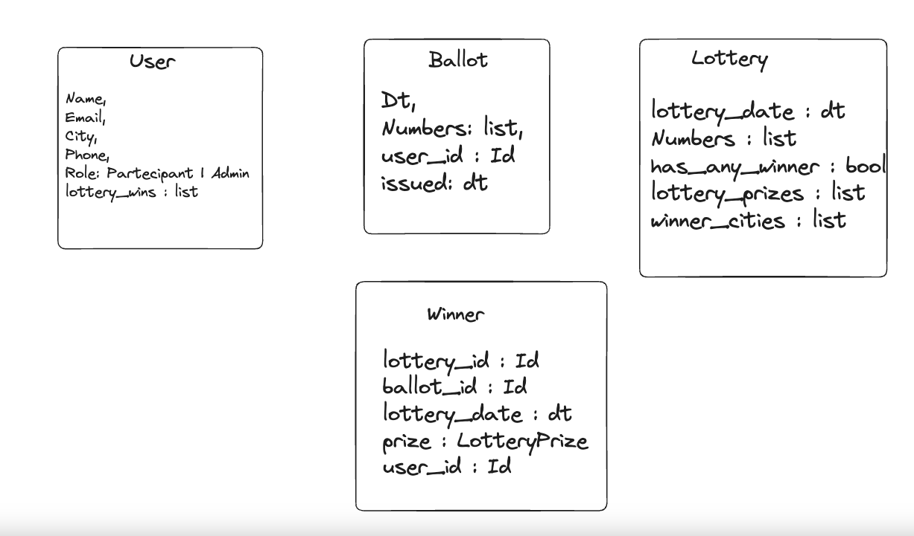
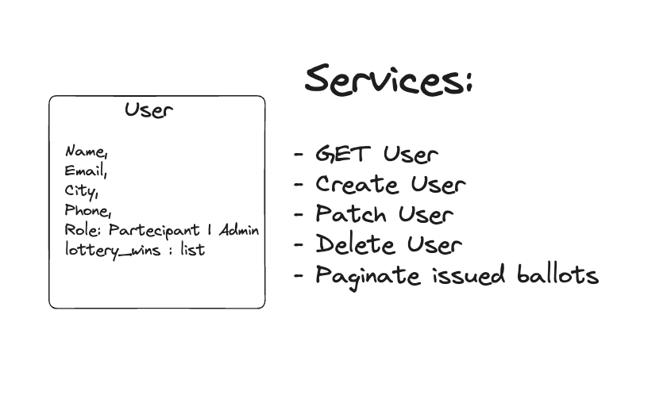
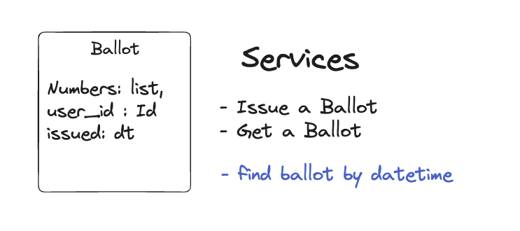
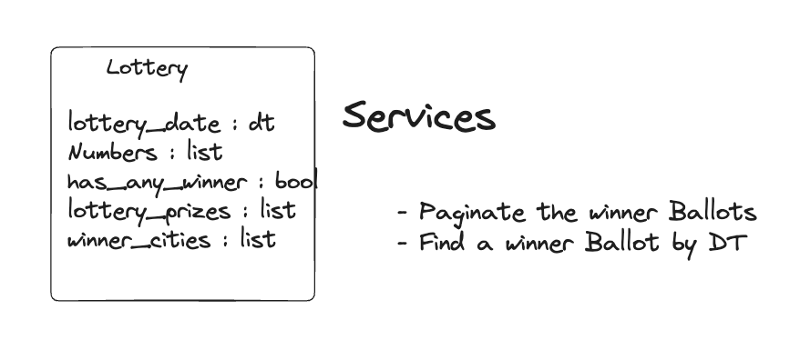
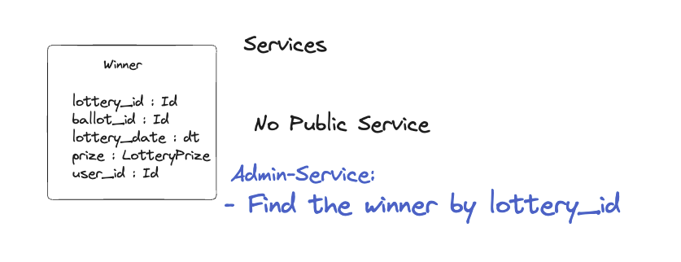

# Introduction

My Lottery system is composed of the following entities:

- Participant: The final user (the main actor)
- Ballot: To play the lottery, participants need to submit a ballot(s)
- Lottery: Represented by the extracted numbers and lottery date

My first draft, at first read, was something like this:

Below are all the details about my solution.

# Stack

I chose one of my confortable stack:
## FastAPI - MongoDB - Celery
### Language: Python

## System
The ideal lottery system is something that looks like this image:
- A web app (frontend) [not implemented] where the user can sign up, play the ballots, and see the winning ballots
- Authenticator module [not implemented]: Users need to sign up with email and password or with an OAuth 3rd party provider (Facebook/Google) to use the web app
- The API and Jobs Server with FastAPI
- The database using MongoDB to store all data and query it

# Entities Overview

## Services

### User

A User is represented by generic and personal information, and a role (by default, all users are participants; they cannot perform admin/sensitive operations).

User Services primarily consist of _CRUD_ database operations.

_NB: Paginate issued ballot is not implemented_

### Ballot

A Ballot is created by the participant and contains 6 numbers between 1 and 90.

The ballot's services are twofold:
A Ballot can:
- Be issued by a participant
- Be read by a participant

**Blu: services not implemented yet**

### Lottery

A Lottery is an entity created each day at midnight when the lottery is closed. It contains the numbers extracted in that lottery, the lottery_date (the datetime when it's closed), and other secondary information if there are winners, such as cities or prizes won in that lottery.

Lottery Services:
- Paginate the winner Ballots [Not Implemented]: As a user, I want to read all lottery extractions
- Find a winner ballot by date: As a user, I can find a lottery extraction by date

### Winner

Winner is a service entity. Since the Lottery's winner is sensitive and important data for the entire system, I chose to store the winner in a separate collection.

The winner entity contains:
- Lottery_id: Easy to query by the lottery's id to understand if there is/are winner(s)
- Ballot_id: The ballot used to win the lottery
- Lottery date: A duplicate field taken from the lottery
- Prize: The prize won with the ballot
- User_id: The participant's id who won the Lottery

As a sensitive entity, I prefer not to expose any public services.

**Only admin [not-implemented] can access to some services**

**Blu: services not implemented yet**

# Design Choices

## One Lottery per day

The second requirement was clear:
> Lottery participants will be able to submit as many lottery ballots for any lottery that isn’t yet finished.

In the initial iteration of my system, there is one lottery per day that closes at midnight. Participants are able to submit as many lottery ballots as they like for a lottery that is still open.

The ideal solution would have been to fully implement the requirement across multiple iterations. However, due to time constraints and prioritization of core functionalities, I was unable to complete the full implementation in this version. Future iterations will fully meet the requirement.

## Why Winner Entity

I decided to have a separate Winner entity to keep things simple and secure.

- Privacy: Winning big can involve huge amounts of money, so I want to keep that information safe and private.

- Security: Keeping winner details in a separate place helps to control who can see and handle this data. It’s easier to keep an eye on and protect valuable prize information when it’s isolated from other data.

- Better Management: Handling winner info separately makes it simpler to manage and access. It keeps prize details organized and secure without mixing them with other services.

# Product Next Iterations:

- Admin Operations: Find / Paginate the Winners
- As a user/participant, I want to read all the lotteries
- As a participant, I want to see all my issued ballots with the relevant information
- As a participant, I want to play different lotteries each day
- As a lottery system, I want to support different types of games
- Notifications:
    - As a participant, I want to be notified about my issued ballot: whether I won or not
    - As a winner, I want to choose to share my city and prize with everyone
- Admin Notifications:
    - As an admin, I want to be notified when someone wins
